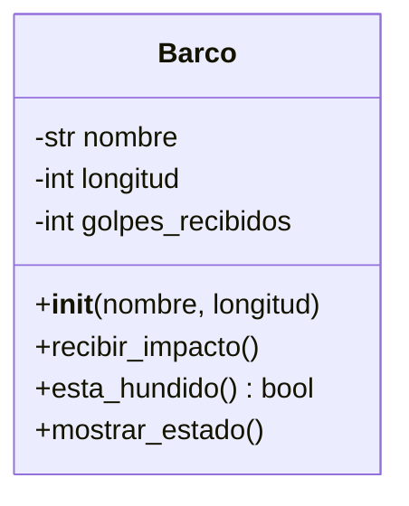
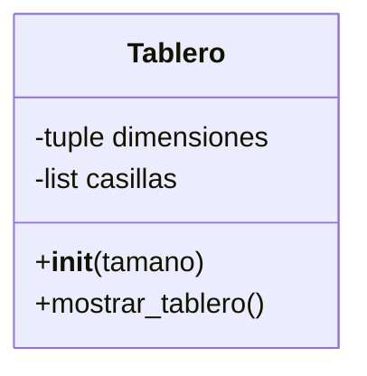
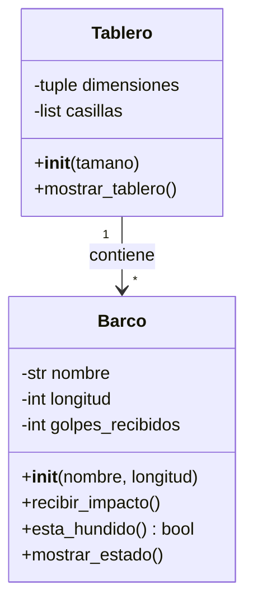

# Hundir la Flota - Diseño de Clases

## Descripción del Proyecto
Implementación de las clases principales para el juego clásico "Hundir la Flota" (Battleship), desarrollado como parte de la asignatura COD del ciclo superior DAM-1.

## Tecnologías
- **Lenguaje:** Python 3
- **IDE Recomendado:** PyCharm
- **Estándares:** PEP 8

## Diagramas de Clase

### Clase Barco


### Clase Tablero


### Diagrama Completo del Sistema


## Estructura del Proyecto
```
hundir-la-flota/
│
├── README.md
├── barco.py
└── tablero.py
```

## Uso

### Clase Barco
```python
from barco import Barco

# Crear un submarino
submarino = Barco("Submarino", 1)

# Recibir impactos
submarino.recibir_impacto()

# Verificar si está hundido
if submarino.esta_hundido():
    print("¡El submarino ha sido hundido!")
```

### Clase Tablero
```python
from tablero import Tablero

# Crear un tablero 10x10
tablero = Tablero(10)

# Mostrar el tablero
tablero.mostrar_tablero()
```

## Pruebas
Cada clase incluye un bloque de pruebas que se ejecuta cuando el archivo se ejecuta directamente:

```bash
python barco.py
python tablero.py
```

## Convenciones de Código
- Nombres de clases en **PascalCase** (Barco, Tablero)
- Nombres de métodos y atributos en **snake_case** (recibir_impacto, golpes_recibidos)
- Comentarios descriptivos siguiendo PEP 8
- Docstrings para clases y métodos principales

## Autor
Felipe (DAM-1 - COD)

## Licencia
Proyecto educativo
